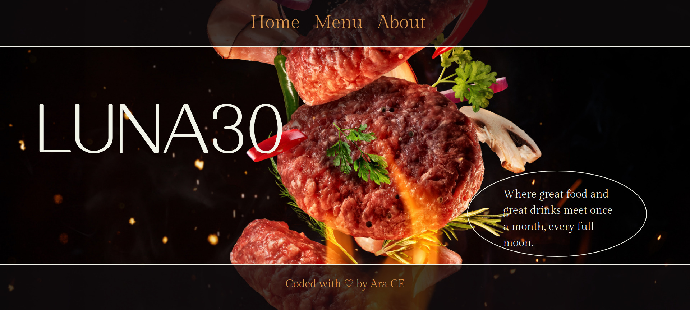

# restaurant_js
A simple Restaurant Homepage to practice DOM manipulation through dynamic rendering, the use of event listeners, and webpack to divide each content part into modules and reduce the load time of the site.

<!-- TABLE OF CONTENTS -->
## Table of Contents
- [restaurant_js](#restaurant_js)
  - [Table of Contents](#table-of-contents)
- [About The Project](#about-the-project)
  - [Installation](#installation)
  - [Live View:](#live-view)
- [Authors](#authors)
- [Acknowledgements](#acknowledgements)
- [Show your support](#show-your-support)
<!-- ABOUT THE PROJECT -->
# About The Project
A simple Restaurant Homepage to practice DOM manipulation through dynamic rendering, the use of event listeners, and webpack to divide each content part into modules and reduce the load time of the site.

When you click on each navigation link "Home, Menu, About" you will see the page doesn't reload, but it'll render a different content each time. This is through DOM manipulation, resetting the DOM each time a link is clicked and the appending the proper and corresponding content to each link.

## Installation
* Clone the repo with [this repo link](https://github.com/aracelicaes/restaurant_js/tree/feature/restaurant)

## Live View:

Check out the Live View [Here!](https://github.com/aracelicaes/restaurant_js/tree/feature/restaurant)

<!-- CONTACT -->
# Authors
👤 **Ara Camarillo**

- Github: [aracelicaes](https://github.com/aracelicaes)
- Twitter: [@Ara_CE_93](https://twitter.com/Ara_CE_93)
- Linkedin: [Ara Camarillo](www.linkedin.com/in/ara-camarillo)

📄 **Project Link: [Click Here](https://github.com/aracelicaes/restaurant_js/tree/feature/restaurant)**

<!-- ACKNOWLEDGEMENTS -->
# Acknowledgements

- [Microverse](https://microverse.org)
- [Best-README-Template](https://github.com/othneildrew/Best-README-Template)
- [The Odin Project](https://www.theodinproject.com/paths/full-stack-javascript/courses/javascript/lessons/restaurant-page)
# Show your support

Give a ⭐️ if you like this project!
